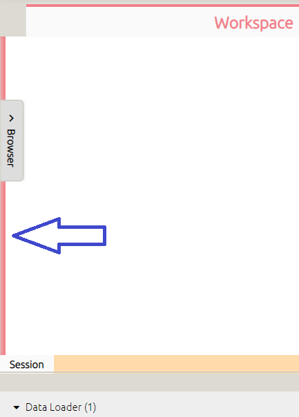

# Testing Project CAM

Below listed some expected behaviors of the application for testing. The screenshots are only for demonstration and might not include the latest behaviors.

## Workspace (empty)

Some behaviors to be tested are:

- On MacOS, the Titlebar/Menubar buttons should be rendered as traffic lights on the top left corner.
- Switching between tabs on the Tab list should be possible.
- Rearranging session items on the Tab list should be possible.
- Clicking/Hovering (depending on how the Browser is configured) should open the Browser.
- When no sessions are available, the icon and the hint should appear as above.
- The hint should be on the opposite side of the Browser, i.e., if the browser is on the left side, the hint should be on the right side and vice versa.
- Click `Add Session` to add new session.
- Click `Rename Session...` (available only if there is a session opening) to launch an input box to rename the session. This follows the [Naming Convention](#naming-convention).
- Click `Remove Session...` (available only if there is a session opening) to remove the session (will first launch a confirmation box).

## Graph

Some behaviors to be tested are:

- Pinch or wheel to zoom in/out.
- Hold **Shift** to move the map around.
- Click `Select all` to select all components and connections.
- Click `Detach` to disconnect selected connections (only available if *at least* one connection is selected).
- Click `Reset pan/zoom` to remove all transformations made to the map (only available if the map has been transformed).
- Click on a connector and a line will be drawn following the movement of the pointer until something is clicked (see the picture below).
- Click `To Workspace...` to switch to Workspace and highlight the component. If the component has been minimized to the tray in Workspace, the one in the tray will be highlighted.
- Click `Color` to launch a color box to change the color of the component.
- Click `Rename` to launch an input box to rename the component, following the [Naming Convention](#naming-convention).
- Click `Duplicate` to duplicate the component. The new component will be positioned following the [Positioning Convention](#positioning-convention).
- Click `Delete` to remove the component (will first launch a confirmation box).
- Double click on the component to minimize/maximize. When minimized, the component merges all the input and output connectors into one. The picture above depicts a *maximizing* component.
- Resizing the component should be possible. Note that it only changes the width.
- Dragging the component should be possible if the pointer starts anywhere except the connectors.
- If multiple components are selected, they will all be dragged and/or resized together.
- When dragging/resizing, the connected lines are hidden and will only be drawn after the operation is done.
- An alert box will appear in the event of an effort to create a loop which might lead to endless processing of the components.
- If the component is processing, it will be highlighted **yellow**.

- Colors of lines and connectors:
    - If a connected line is selected, it and its connector will be colored maroon.
    - If a connector is clicked and in drawing mode, it and its moving line will be colored blue.
    - Otherwise, they are colored pink.

## Component List

Some behaviors to be tested are:

- Switching between Components and Logs should be possible.
- Package/Component item expanding/collapsing should be possible.
- Dragging component items and dropping them into Workspace/Graph of a session should be possible.
- Click `Add to Current Session` to add the component following the [Positioning Convention](#positioning-convention).
- Click `Move Library Right` to move the browser to the right side. The option will then become `Move Library Left`.
- Enabling `Auto Show Library` to have a small red edge that when hovered, the browser will be shown (see the picture below).

- Enabling `Auto Hide Library` to close the browser after the pointer leaves it for a short duration.
- Click `Hide Library` to hide the browser (return it by enabling the `Layout > Browser` option in the `View` menu).
- Click `Add Packages...` to launch a box to open a Package JSON File to install new package. This should also switch the browser to Logs.
- Enabling `Clean Co-Existing Versions After Installation` to cleanup other installed versions of the same package id. This is useful when updating since keeping old versions is not necessary.
- Enabling `Force Package Installation` to always install what is provided in the Package JSON File. In other words, it will try to install as many components listed in the JSON file as possible, even when the same version of some component already exists.
- Click `View Package Info` to view a box that shows the information of all packages (see the picture below). Clicking on the backdrop, as well as the Close icon, should hide the box.
- The expanding/collapsing state of all packages and components should be saved between each run of the application.

## Logs (from the package system)

Some behaviors to be tested are:

- Switching between Components and Logs should be possible.
- Click `Clear` to clear all logs.

## Component (in Workspace)

Some behaviors to be tested are:

- Click the `Minimize` icon to hide the component into the tray.
- Click the `Lock/Unlock` icon to prevent/allow pointer interaction with the component body.
- Click `Color` to launch a color box to change the component background color (see the picture below).

- Click `Rename` to launch a rename box to change the component name (see the picture below). This follows the [Naming Convention](#naming-convention).

- Click `Duplicate` to duplicate the component. The new component will be positioned following the [Positioning Convention](#positioning-convention).
- Click `Reset` to reset the component to its factory state.
- Click `Delete` to remove the component (will first launch a confirmation box).
- Click the component status to switch it between the two states **Connected** and **Idle**. If the component is in Idle mode, it will not receive new input (if any) from its providers.
- The traffic box should show which components the current one is receiving input from, and passing its output to.
- Click the component traffic box toggler to show/hide the traffic box.
- The component body should render the HTML file that comes with the component.

## Tray (in Workspace)

Some behaviors to be tested are:

- Click the category toggler to show/hide the minimized components of that category.
- Click the `Maximize` icon to remove the component from the tray and display it in the Workspace. This should also decrease the counter in the category title, and if it goes to 0, remove the category from the tray.
- Right-click on the component minimized to launch the context menu, which is almost the same as the component context menu in [Graph](#graph).

## Tray edge (in Workspace)

Some behaviors to be tested are:

- Hovering over the edge should make it appear red.
- Clicking and dragging the edge up and down to adjust the height of the tray should be possible.
- Double clicking the edge to reset the height of the tray to its default value.

## Session List

Some behaviors to be tested are:

- Click `Add Session` to add new session.
- Click `Duplicate` (available only if the context menu is open on a session item) to duplicate the session.
- Click `Rename Session...` (available only if the context menu is open on a session item) to launch an input box to rename the session. This follows the [Naming Convention](#naming-convention).
- Click `Remove Session...` (available only if the context menu is open on a session item) to remove the session (will first launch a confirmation box).
- If the number of session items makes the list exceed its width, there should be two *left* and *right* arrow icons to navigate through the sessions.
- If a component item is being dragged from the component list (browser) and the pointer moves over a session item for a short duration, that session should be switched to.

## Titlebar/Menubar

Some behaviors to be tested are:

- Click `New Project` to start a new project (will first launch a confirmation box).
- Click `Open Project...` to select a CAM Project File to load. Note that this will update the title of the File menu to the name of the selected file.
- Click `Save Project` to save the project to the last selected file (by either opening or saving).
- Click `Save Project As...` to choose the destination for the project to be saved to. If no file has been selected (by either opening or saving), this should not be possible, and the behavior should belong to `Save Project`.
- Click `Exit` to quit the application (will first launch a confirmation box).
- Click `Undo` to undo the last operation done in either Workspace or Graph (depending on which is being worked on). Same for `Redo`.
- Enabling `Auto Save Every 5 Minutes` to save the project to a temporary directory every 5 minutes. Whenever it is done, a toast notification will be shown in the bottom right corner.
- Click `New Session` to add new session.
- Click `Open Session...` to select a CAM Session File to load. This adds new session.
- Click `Import Session...` to select a CAM Session File to load. This does not add new session, but instead, merges the loaded data with the current session. Only available if a session is opened.
- Click `Save Session As...` to choose the destination for the session to be saved to. Only available if a session is opened.
- Enabling `Absolute API Permission Check` to have a confirmation box shown every time a component calls the `readfileabsolute` or `savefileabsolute` operation.
- Enabling `Port API Warning` to have a confirmation box shown every time a component calls the `bindtoport` operation.
- Enabling `Strict Mode` to disallow connecting between different types of input/output parameters. In other words, by *strict*, it means only connections between parameters with the same type are allowed.
    - The option is session-specific, which means it is subject to change when switching between sessions, and only available if a session is opened.
    - If `Strict Mode` is disabled, and there is *at least* one connection that does not satisfy the **strict** condition, the option cannot be enabled and an alert will show up.
- In the `Layout` submenu, enable/disable the options to show/hide the corresponding elements.

## Conventions

### Naming Convention

No components or sessions are allowed to have the same name. The application will try to fix this by adding `#[a suitable order]` to the end of the new name.

### Positioning Convention

When a new component is added programmatically (not by dragging and dropping), the application will position it close to the last-interacted-with component, separately in both Workspace and Graph, but a little to the right and bottom. If the new position makes the component go beyond the frame, either horizontally or vertically, the new `x` and/or `y` coordinate(s) will be reset.

## Author

Quyen Dinh, AI team.